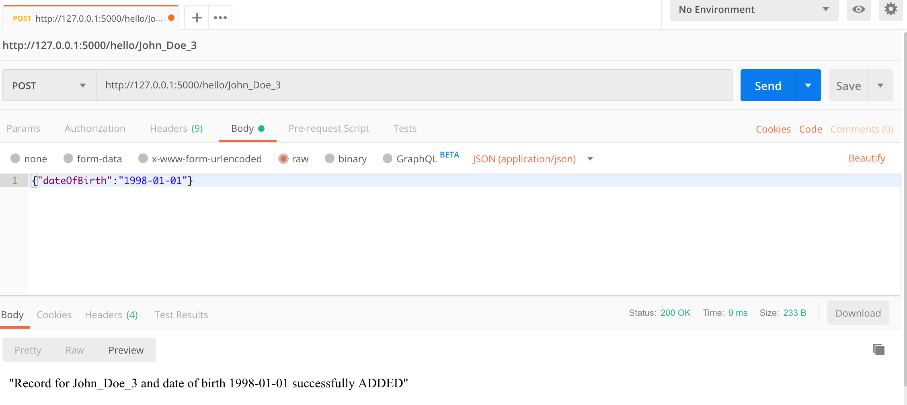
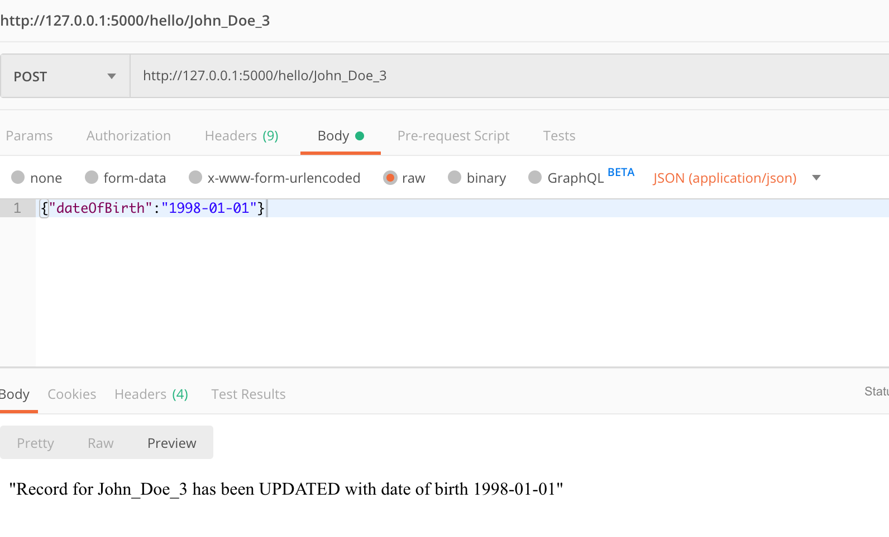
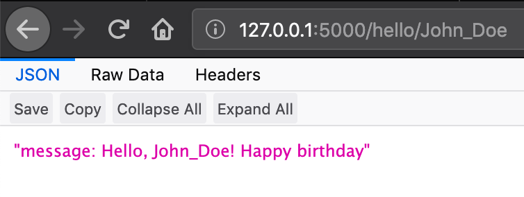
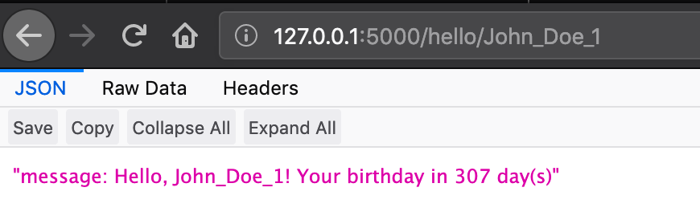

# Application that exposes HTTP-based API (implemented with Python Flask)

> Handle HTTP requests to update and fetch data from the database.

## Prerequisites:
* `Python 3.7.6`
* `Docker Desktop version: 2.2.0.0`
* `kubernetes v1.15.5`


## Table of contents and structure

```
.
├── README.md
├── api
│   ├── server.py
│   └── users.db
├── database
│   └── db.py
├── deployment_configuration
│   ├── docker_image
│   │   └── Dockerfile
│   └── kubernetes
│       ├── deployment.yaml
│       └── service.yaml
├── readme_images
├── requirements.txt
└── tests
    └── server_test.py
```

## Scope:
* `api/server.py`:
```
    1. creates API with the Flask framework used;
    2. GET and POST (only application/json content type)
       methods are supported;
    3. API makes calls to Sqlite3 database for updating
       and fetching data;
    4. endpoint exposed /hello/<username> with dynamic
       lookup value for username in request data;
    5. Implemented logic for updating values in DB if the username exists
       and create a new one - if missing;
    6. Username should be a unique value;
    7. The logic for birthday delta calculation is
       applied and respective messages displayed;
```
* `api/user.db` - Sqlite3 database with the records;
* `database/db.py`:
```
    1. creates a Sqlite3 database, with the name specified;
    2. creates a table in the database;
```

## Usage:
* Start the application with next commands:

```
    $ cd python3-http-based-api/
    $ virtualenv -p python3 ./venv
    $ source venv/bin/activate
    $ pip3 install -r requirements.txt
    $ cd api/
    $ ./server.py
```

* Make a POST request with sending body message as a JSON (use curl or Postman):

```
* endpoint: http://127.0.0.1:5000/hello/<username>
* request: {"dateOfBirth":"1998-01-01"}
```

```
* if the same username will be used - the record will be updated:
```


* Get request for a username and respective messages displayed for a birthday:
```
If birthday is today:
```


```
Any other day:
```


## Building the docker image and deployment into K8S:

```
cd deployment_configuration/docker_image
docker build -t python_http_api:1.0.0 .
kubectl apply -f ../kubernetes/deployment.yaml
kubectl apply -f ../kubernetes/service.yaml
```
* Navigate in browser to http://localhost:30000/hello/John_Doe and `JSON` data should be rendered as followed:
```
"message: Hello, John_Doe! Your birthday in 147 day(s)"
```
